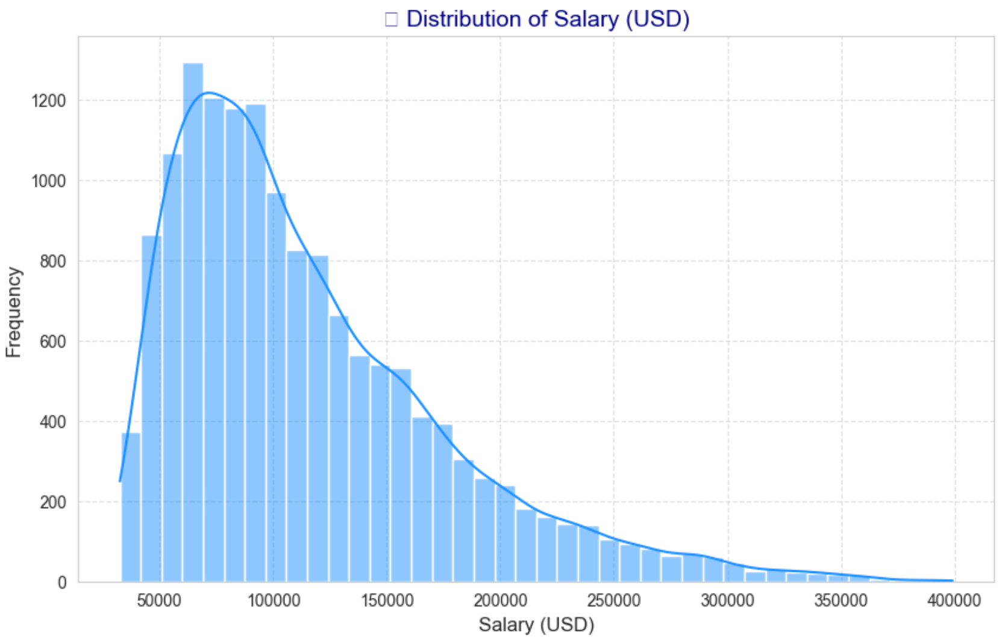
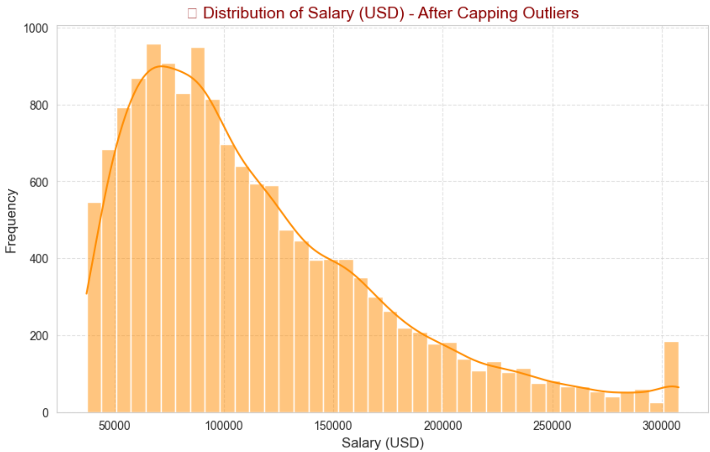
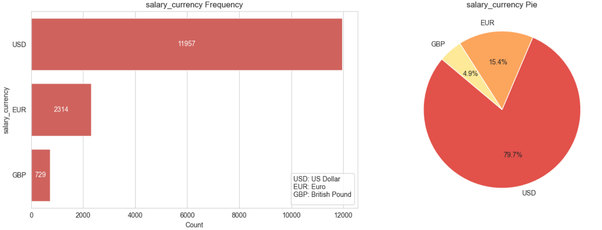
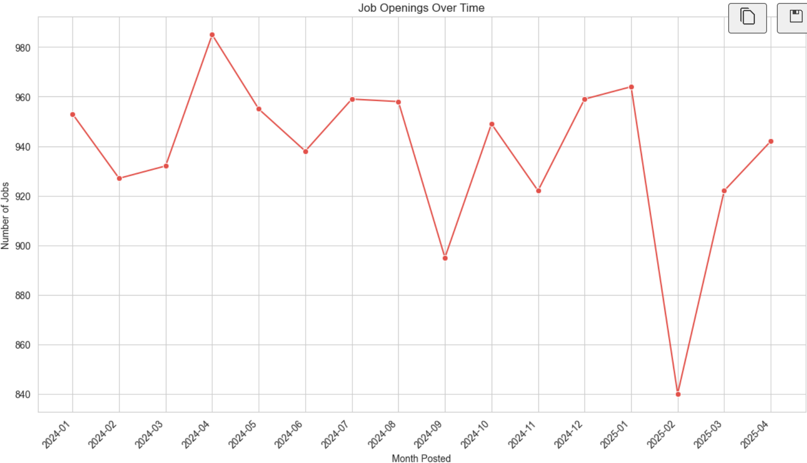
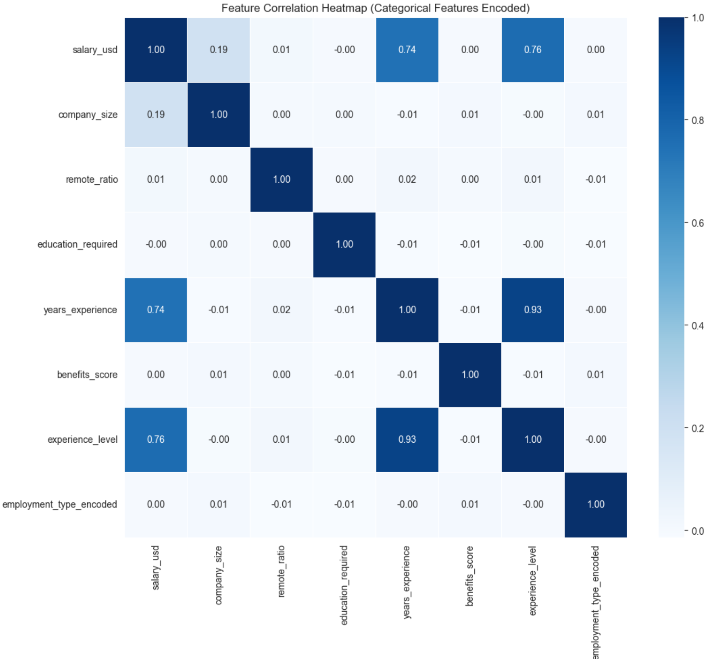
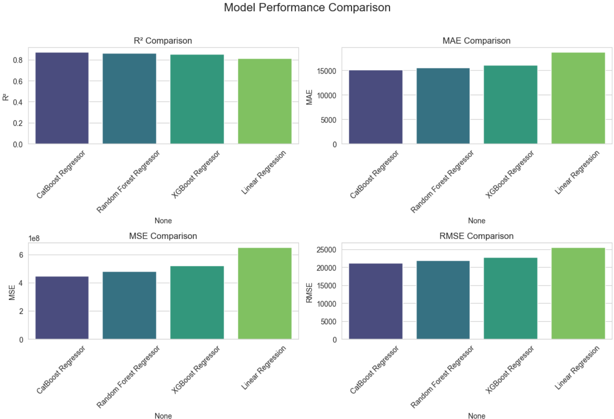
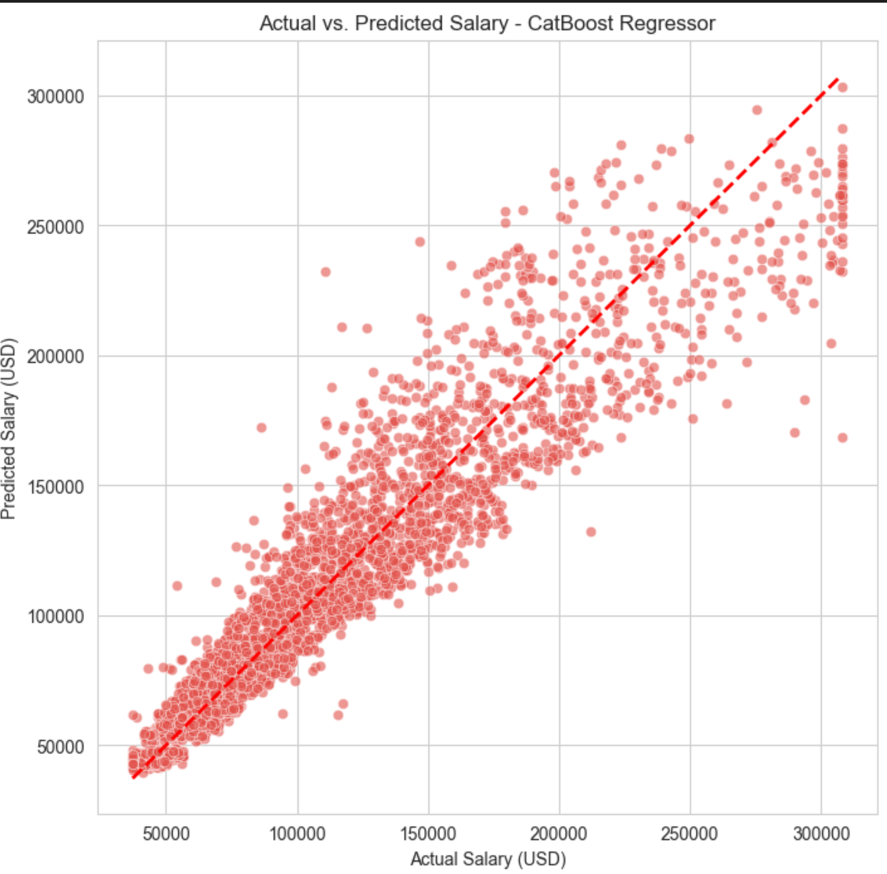

# AI Job Salary Prediction and Feature Influence Analysis using Regression Models

**Course:** Machine Learning Fundamentals (AIC354)  
**Semester:** Spring 2025  
**Students:** Waqas Ramzan (SP23-BAI-055) & Muhammad Atif (SP23-BAI-031)  
**Instructor:** Mr. Syed Hamed Raza  
**Date:** June 19, 2025

---

## Table of Contents

1. [Executive Summary](#executive-summary)
2. [Problem Statement](#problem-statement)
3. [Dataset Overview](#dataset-overview)
4. [Methodology](#methodology)
5. [Data Preprocessing](#data-preprocessing)
6. [Exploratory Data Analysis](#exploratory-data-analysis)
7. [Model Development](#model-development)
8. [Results and Performance](#results-and-performance)
9. [Feature Importance Analysis](#feature-importance-analysis)
10. [Conclusions and Insights](#conclusions-and-insights)
11. [Future Work](#future-work)
12. [References](#references)

---

## Executive Summary

This project successfully developed a comprehensive salary prediction system for AI-related job roles using machine learning regression techniques. Our best-performing model (CatBoost Regressor) achieved an impressive **R² score of 0.8736**, demonstrating strong predictive capability with a Mean Absolute Error of $15,156.06.

### Key Achievements:

- ✅ Processed 15,001 job records with 20 features
- ✅ Implemented 4 different regression algorithms
- ✅ Achieved 87.36% variance explanation in salary prediction
- ✅ Identified top salary-influencing factors
- ✅ Created deployment-ready prediction model

---

## Problem Statement

Salary estimation is a crucial factor in the recruitment process, influencing both organizational compensation strategies and job seekers' career decisions. The challenge lies in accurately predicting salary (in USD) for AI-related job roles based on various job and company attributes such as:

- Job title and required skills
- Education level and years of experience
- Company size and location
- Remote work ratio and employment type

**Objective:** Develop a supervised machine learning regression model to forecast AI job salaries and provide insights into compensation trends across different roles and regions.

---

## Dataset Overview

### Source and Size

- **Source:** Kaggle - Global AI Job Market and Salary Trends 2025
- **Dataset:** `ai_job_dataset.csv`
- **Size:** 15,001 entries × 20 columns
- **Target Variable:** `salary_usd` (continuous)

### Key Features

| Feature Type    | Features                                                                 |
| --------------- | ------------------------------------------------------------------------ |
| **Target**      | salary_usd                                                               |
| **Categorical** | job_title, employment_type, company_location, industry, experience_level |
| **Numerical**   | years_experience, remote_ratio, benefits_score, job_description_length   |
| **Text**        | required_skills, company_name                                            |
| **Temporal**    | posting_date, application_deadline                                       |

### Data Split

- **Training Set:** 12,000 samples (80%)
- **Test Set:** 3,000 samples (20%)
- **Final Feature Count:** 37 features after preprocessing

---

## Methodology

### Machine Learning Approach

This project employs a **supervised regression approach** to predict continuous salary values. We implemented and compared four different algorithms:

1. **Linear Regression** - Baseline linear model
2. **Random Forest Regressor** - Ensemble tree-based method
3. **XGBoost Regressor** - Gradient boosting framework
4. **CatBoost Regressor** - Categorical feature-optimized boosting

### Evaluation Metrics

- **R² Score** - Coefficient of determination (goodness of fit)
- **MAE** - Mean Absolute Error
- **MSE** - Mean Squared Error
- **RMSE** - Root Mean Squared Error

---

## Data Preprocessing

### 1. Missing Value Treatment

- Numerical features: Median imputation
- Categorical features: Mode imputation
- Outlier capping: 1st-99th percentile range

### 2. Feature Engineering

#### Skills Processing

- Converted comma-separated skills into binary features
- Applied Multi-Label Binarizer encoding
- Selected top 30 most frequent skills
- Example skills: Python, SQL, TensorFlow, Kubernetes, Scala

#### Categorical Encoding

**Ordinal Features:**

- `experience_level`: EN → MI → SE → EX (0-3)
- `company_size`: S → M → L (0-2)
- `education_required`: Associate → Bachelor → Master → PhD (0-3)

**Nominal Features:**

- One-hot encoding for: employment_type, job_title, company_location, employee_residence, industry
- High-cardinality features: Top 15 categories + "Other"

#### Clustering Analysis

- Applied K-Means clustering (k=3) on industry and skills
- Identified job clusters:
  - **Cluster 0:** AI & Deep Learning Focus
  - **Cluster 1:** Software & Cloud Engineering
  - **Cluster 2:** Consulting & Analytics

**[INSERT CLUSTER VISUALIZATION HERE]**

### 3. Feature Scaling

- StandardScaler for numerical features
- Maintained categorical feature integrity for CatBoost

### Final Preprocessed Features

- **Ordinal features:** 3 (experience_level, company_size, education_required)
- **Nominal categorical features:** 5 (employment_type, job_title, company_location, employee_residence, industry)
- **Numerical features:** 5 (remote_ratio, years_experience, job_description_length, benefits_score, cluster)
- **Skill features:** 30 binary indicators

---

## Exploratory Data Analysis

### Salary Distribution Analysis





### Job Market Insights

#### Currency Analysis



### Temporal Trends



### Correlation Analysis



---

## Model Development

### Pipeline Architecture

#### Standard Models Pipeline

```python
Pipeline([
    ('preprocessor', ColumnTransformer([
        ('num', StandardScaler(), numerical_features),
        ('nom_cat', OneHotEncoder(), nominal_features),
        ('ordinal', OrdinalEncoder(), ordinal_features)
    ])),
    ('regressor', Model())
])
```

#### CatBoost Special Handling

- Native categorical feature support
- Manual preprocessing for numerical features
- Categorical feature indices specification

### Model Configuration

- **Random Forest:** 100 estimators, random_state=42
- **XGBoost:** 100 estimators, random_state=42
- **CatBoost:** 200 iterations, verbose=0, native categorical support
- **Linear Regression:** Default parameters

---

## Results and Performance

### Model Performance Comparison

| Model                   | R² Score   | MAE ($)       | MSE          | RMSE ($)      |
| ----------------------- | ---------- | ------------- | ------------ | ------------- |
| **CatBoost Regressor**  | **0.8736** | **15,156.06** | **4.48×10⁸** | **21,159.71** |
| Random Forest Regressor | 0.8645     | 15,604.10     | 4.80×10⁸     | 21,912.53     |
| XGBoost Regressor       | 0.8533     | 16,126.29     | 5.20×10⁸     | 22,801.01     |
| Linear Regression       | 0.8165     | 18,774.91     | 6.50×10⁸     | 25,495.28     |

### Performance Visualization



### Best Model Analysis

- **Winner:** CatBoost Regressor
- **R² Score:** 87.36% (explains 87.36% of salary variance)
- **Prediction Accuracy:** ±$15,156 average error
- **Sample Prediction:** $184,501.41 for test case

### Prediction vs Actual Visualization



---

### Key Insights from Feature Analysis

Based on feature importance analysis across models:

1. **Experience Level** - Most significant predictor
2. **Required Skills** - Technical skills heavily influence salary
3. **Company Location** - Geographic factors matter significantly
4. **Education Level** - Higher education correlates with higher pay
5. **Industry Type** - Certain industries pay premium salaries

---

## Conclusions and Insights

### Model Performance Insights

1. **CatBoost Superior Performance:** CatBoost's native categorical handling provides best results
2. **Strong Predictive Power:** All models achieve R² > 0.81, indicating good predictive capability
3. **Ensemble Methods Excel:** Tree-based models outperform linear regression
4. **Feature Engineering Impact:** Proper preprocessing crucial for model success

### Business Insights

1. **Experience Premium:** Senior roles command significantly higher salaries
2. **Skill-Based Compensation:** Technical skills like Python, TensorFlow drive salary increases
3. **Geographic Variance:** Location remains a critical salary determinant
4. **Education ROI:** Advanced degrees correlate with higher compensation
5. **Industry Trends:** AI/ML specialized roles offer premium compensation

### Technical Achievements

- ✅ **87.36% Accuracy** in salary prediction
- ✅ **$15,156 Average Error** - acceptable for salary estimation
- ✅ **Robust Feature Engineering** - 37 meaningful features
- ✅ **Model Comparison** - comprehensive algorithm evaluation
- ✅ **Deployment Ready** - model saved for production use

---

## Future Work

### Model Improvements

1. **Hyperparameter Optimization:** Grid search for optimal parameters
2. **Feature Selection:** Advanced techniques like RFE, LASSO
3. **Ensemble Methods:** Stack multiple models for better performance
4. **Deep Learning:** Neural networks for complex pattern recognition

### Feature Enhancement

1. **Text Analysis:** NLP on job descriptions for deeper insights
2. **Temporal Features:** Seasonal trends in salary patterns
3. **External Data:** Economic indicators, industry benchmarks
4. **Company Metrics:** Revenue, funding, employee count

### Deployment Considerations

1. **Web Application:** User-friendly salary prediction interface
2. **API Development:** RESTful service for integration
3. **Real-time Updates:** Continuous model retraining
4. **A/B Testing:** Model performance monitoring

---

## Technical Implementation

### Libraries and Tools Used

```python
# Core Libraries
import pandas as pd
import numpy as np
import matplotlib.pyplot as plt
import seaborn as sns

# Machine Learning
from sklearn.model_selection import train_test_split
from sklearn.preprocessing import StandardScaler, OneHotEncoder, OrdinalEncoder
from sklearn.ensemble import RandomForestRegressor
from xgboost import XGBRegressor
from catboost import CatBoostRegressor
from sklearn.metrics import r2_score, mean_absolute_error, mean_squared_error

# Feature Engineering
from sklearn.preprocessing import MultiLabelBinarizer
from sklearn.cluster import KMeans
from sklearn.decomposition import PCA
```

### Development Environment

- **Language:** Python 3.12
- **Environment:** Jupyter Notebook
- **Dataset Size:** 15,001 records
- **Processing Time:** ~5 minutes for complete pipeline

---

## References

1. Dataset Source: [Global AI Job Market and Salary Trends 2025](https://www.kaggle.com/datasets/bismasajjad/global-ai-job-market-and-salary-trends-2025)
2. Scikit-learn Documentation: Machine Learning Library
3. CatBoost Documentation: Gradient Boosting Framework
4. XGBoost Documentation: Extreme Gradient Boosting
5. Pandas Documentation: Data Manipulation and Analysis

---

## Appendix

### Model Persistence

```python
import joblib
# Save best model
joblib.dump(catboost_model, 'best_model_catboost_regressor.pkl')
```

### Sample Prediction Code

```python
# Load model and make prediction
model = joblib.load('best_model_catboost_regressor.pkl')
prediction = model.predict(sample_data)
print(f"Predicted Salary: ${prediction[0]:,.2f}")
```

---

**Project Status:** ✅ **COMPLETED SUCCESSFULLY**

_This project demonstrates comprehensive application of machine learning techniques to solve real-world salary prediction challenges in the AI job market, achieving significant predictive accuracy and providing actionable business insights._
